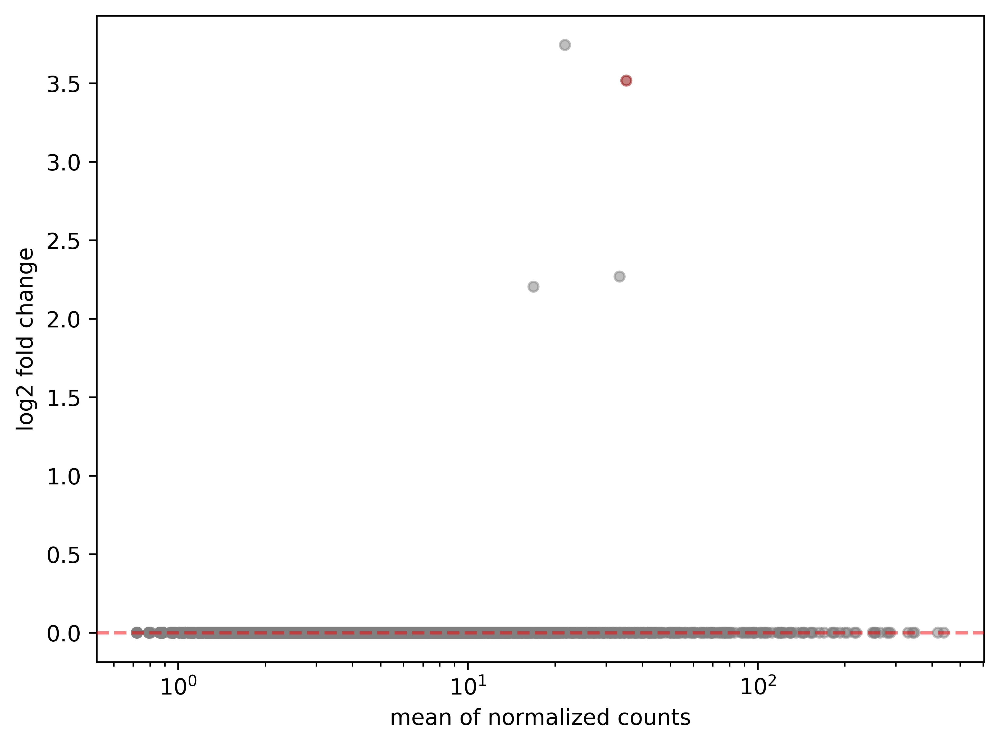
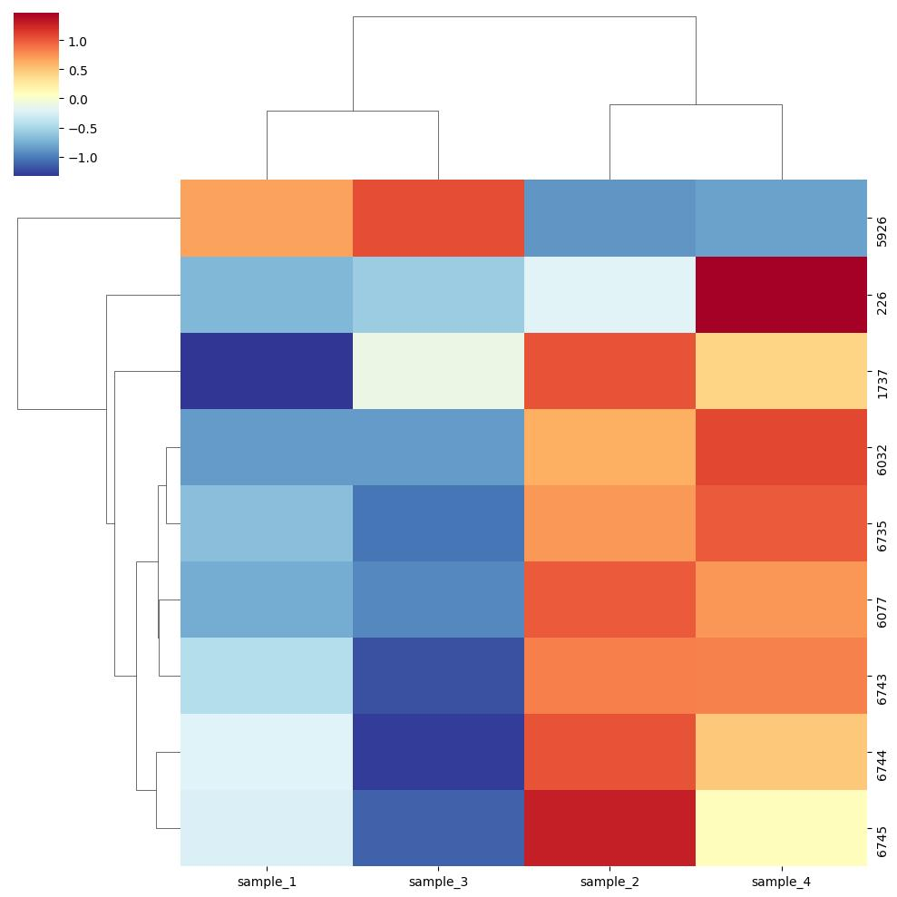
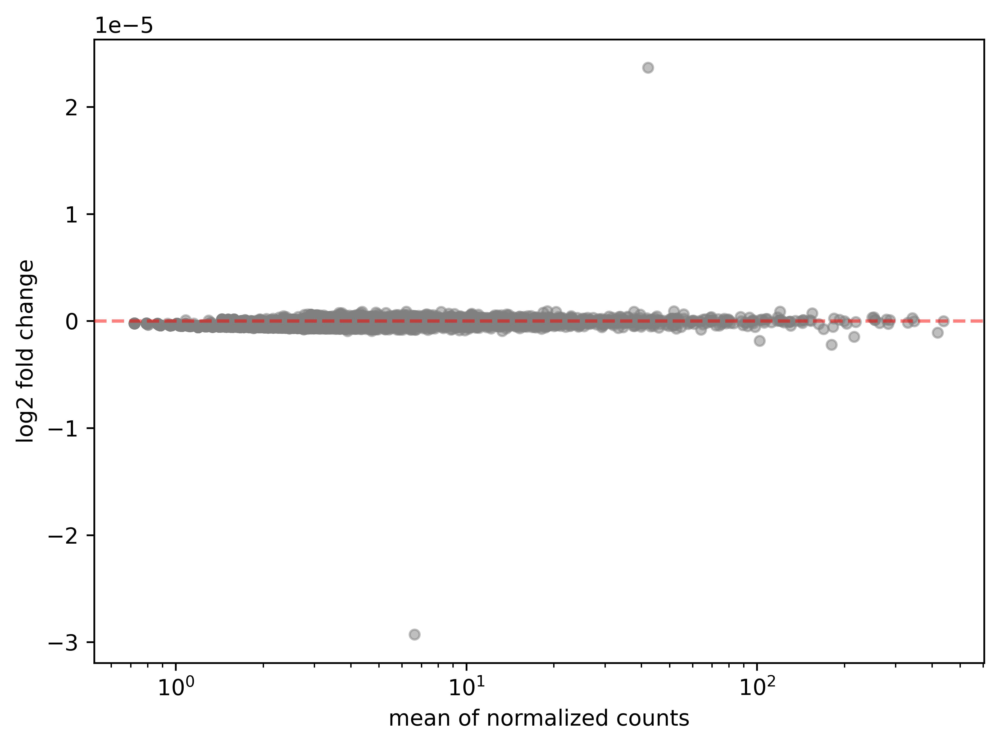

# Comparación de datos de expresión de la bacteria fijadora de nitrógeno FRANKIA.

Nombre:  Ángel Román Zamora López (<angelzl@lcg.unam.mx>)
Nombre:  Erika Nathalia Ordoñez Guzmán (<erikaog@lcg.unam.mx>)

Fecha: 01/10/2024

### Introducción:
Las bacterias fijadoras de nitrógeno tienen un gran papel en la ecología, reforestación y restauración de zonas protegidas. Su principal papel está en la fijación de nitrógeno N2 que por lo general obtienen del suelo, con la intención de convertir esta molécula de nitrógeno en una más compleja con la intención de funcionar como nutriente para las plantas, pues este elemento es de suma importancia para la composición de ácidos nucléicos y la producción de proteínas esenciales para el desarrollo de las mismas. Su proceso es llevado a cabo en los llamados nódulos, que son protuberancias o tumores que se encuentran en las raíces de árboles y arbustos de las denominadas "plantas actinorrícicas", esta es la manera en que establecen una relación simbiótica mutualista con los árboles.
Especialmente, las bacterias fijadoras de nitrógeno Frankia, son bacterias Gram positivas, que a diferencia de otras bacterias fijadoras no se encuentran en las raíces de las leguminosas, sino en las raíces de los árboles.
Es conocida por ser saprófita, lo que significa que puede sobrevivir en medios limitados de azúcar, por lo que debe tener los genes mínimos indispensables para su supervivencia, aunado a su condición de simbiótica.
Fue elegida la cepa EAN1pec, de las bacterias Frankia, debido a que presenta relación con gran parte de plantas importantes, como: Elaeagnus ssp., Hippophae sp., Shepherdia spp. y potencialmente muchos hamamelípidos. Además de formar parte del grupo filogenético III de las bacterias fijadoras de nitrógeno, lo que la hace más promiscua y por tanto, interesante para su estudio por su papel en la fijación de nitrógeno de gran cantidad de árboles.
Como es de esperar, EAN1pec no es la excepción, contiene un set genético particular que le permite sobrevivir a condiciones de estrés particulares, donde la deficiencia de N2 es una de ellas.

##### Planteamiento del problema:
La bacteria fijadora de nitrógeno FRANKIA tiene un papel importante en la ecología, por su presencia en las raíces de los árboles alrededor de todo el mundo.
Es por esto que ha sido elegida para analizar su nivel de expresión en diferentes condiciones, que son deficiencia y abundancia de nitrógeno. La cepa seleccionada es EAN1pec.
Los datos se obtuvieron de la base de datos de GEO: https://www.ncbi.nlm.nih.gov/geo/query/acc.cgi?acc=GSE64517. Para obtener los datos de la expresión génica se secuenciaron los transcritos con el secuenciador Ilumina.
Buscamos encontrar los genes que mientras se encuentran activados o en su caso, inactivos, le permiten a la bacteria fijadora de nitrógeno adaptarse a condiciones de estrés por deficiencia de nitrógeno. Asimismo, consideramos de suma importancia tener en cuenta el nivel de expresión, no solo conocimientos sobre la activación o inactivación de genes.
Aunado a lo anterior, buscamos, encontrar la manera en que logra sobrevivir en estas condiciones de experimentación que también se pueden ver en la naturaleza y con esto comprender la interacción entre niveles de expresión y adaptabilidad de los organismos a ciertas condiciones.
La importancia de nuestra investigación resalta en que el nitrógeno es un elemento esencial para el desarrollo de muchas plantas, tanto para sintetizar ácidos nucléicos y la producción de proteínas.

## Metodología:  
Los datos de entrada que se presentan para este proyecto se presentan en 6 archivos, de la misma cepa EAN1pec. Estos archivos se organizan de modo que se presentan dos condiciones, abundancia de nitrógeno (NH4) y por otro lado la deficiencia de nitrógeno (N2). Cada condición produjo tres archivos más, con los niveles de expresión, es decir, está organizado por lotes. Esto es importante, pues debido a que los tres lotes presentan diferencias en algunas columnas de expresión y lecturas, los datos se deberán normalizar para poder comparar.
Los datos fueron descargados de GEO (https://www.ncbi.nlm.nih.gov/geo/query/acc.cgi?acc=GSE64517) en formato slsx, por lo que para su mejor manejo, se cambió el formato a uno más amigable y manejable con un convertidor en línea. 
Las lecturas fueron conseguidas mediante el método RNAseq, secuenciados por Ilumina. Todos los archivos cuentan con la misma estructura: Nombre del cromosoma  y cromosoma(todos los archivos tienen el mismo nombre y un único cromosoma bacteriano), región de expresión, el valor de expresión, la longitud del gen (dato que no será necesario agregarlo a la investigación), cuenta con los valores de RPM, cuyos datos se normalizaron para trabajarlo desde los sets de datos. y por último las lecturas genéticas únicas. 
Todos los datos anteriormente mencionados se encuentran en la carpeta de “data”, en un archivo comprimido.
Con lo dicho anteriormente ¿Qué genes en la bacteria fijadora se encuentran prendidos o apagados en cada una de las condiciones a las que fueron expuestos? ¿Qué tanto se expresaron cada uno de los genes prendidos?

## A. Datos de entrada:
Los datos fueron descargados desde GEO y se encuentran en:
```
|--data
|  |--GSM1573196_Batch_1_EAN1pec_NH4
|  |--GSM1573197_Batch_1_EAN1pec_N2
|  |--GSM1573202_Batch_3_EAN1pec_NH4
|  |--GSM1573203_Batch_3_EAN1pec_N2
|  |--GSM1573208_Batch_4_EAN1pec_NH4
|  |--GSM1573209_Batch_4_EAN1pec_N2
```
##### Metadatos:
Fecha de descarga: 22/10/2024

| Archivo | Descripción | tipo
|:--  |:--  |:--|
| GSM1573196_Batch_1_EAN1pec_NH4 | datos de expresión de EAN1pec, del primer lote y en abundancia de NH4. | formato slsx |
| GSM1573197_Batch_1_EAN1pec_N2 | datos de expresión de EAN1pec, del primer lote y en deficiencia de N2. | formato slsx |
| GSM1573202_Batch_3_EAN1pec_NH4 | datos de expresión de EAN1pec, del segundo lote y en abundancia de NH4. | formato slsx |
| GSM1573203_Batch_3_EAN1pec_N2 | datos de expresión de EAN1pec, del segundo lote y en deficiencia de N2. | formato slsx |
| SM1573208_Batch_4_EAN1pec_NH4 | datos de expresión de EAN1pec, del tercer lote y en abundancia de NH4. | formato slsx |
| SM1573209_Batch_4_EAN1pec_N2 | datos de expresión de EAN1pec, del tercer lote y en deficiencia de N2. | formato slsx |

#### Formato de los archivos

- GSM1573196_Batch_1_EAN1pec_NH4.slsx : formato slsx
NOTA: Todos los archivos siguen el mismo formato.

Name	Chromosome	Región	Expression value	Gene length	RPKM	Unique gene reads	Total gene reads
Franean1_0001	CP000820	71..1654	0	1584	0	0	0
Franean1_0002	CP000820	2937..3959	0.458768619	1023	0.458768619	5	5
Franean1_0003	CP000820	3956..5116	1.37440914	1161	1.37440914	17	17
Franean1_0004	CP000820	5118..6491	0.409886723	1374	0.409886723	6	6

Formato:
> a. La primera columna es el nombre del gen o identificador, únicamente se marca la diferencia entre cada gen por el cambio en los números ascendentes.
> b. La segunda columna es el cromosoma, que no cambia porque solo tiene un cromosoma central.
> c. La tercer columna es la región del cromosoma de la que pertenece el gen seleccionado.
> d. La cuarta columna es el valor de expresión, es decir la cantidad de expresión de un gen o transcrito.   
> e. La quinta columna es la longitud del gen.
> f. La sexta columna es el RPKM, que también se refiere al valor de expresión de cada gen pero con el valor numérico normalizado.
> g. La séptima columna es de lecturas genéticas únicas y se refiere a las secuencias que fueron alineadas con gran especificidad a un lugar particular del genoma.
> h. La octava columna contiene lecturas genéticas totales y es parecida a las lecturas genéticas únicas pero sin ser tan específica o con cierta ambigüedad.

#### Preguntas de investigación:

> ¿Qué genes en la bacteria fijadora se encuentran prendidos o apagados en cada una de las condiciones a las que fueron expuestos?
Respuesta: Primero, hacer la normalización entre todos los archivos por lotes de cada condición para posteriormente comprobar el nivel de expresión y guardar aquellos genes que estén prendidos y aquellos que estén apagados.

> ¿Qué tanto se expresó cada uno de los genes prendidos?
Respuesta: Al igual que en la respuesta anterior, los datos se deberán normalizar para poder compararlos, hacer un heatmap para mostrar, de acuerdo a la intensidad del color en la expresión de los genes en las diferentes condiciones.

## Resultados:

### Unifactorial: 



### Multifactorial:




## Análisis y conclusiones:
Con el presente proyecto, podemos concluir que aún cuando se nota una diferencia en la expresión de los genes en las diferentes genes, también es necesario comprobar que esta expresión es significativa. 
El análisis unifactorial nos permite únicamente contrastar las diferentes condiciones con respecto a las condiciones. En la imagen se puede comprobar que aunque son pocos, hay genes que se expresan diferencialmente. Estos genes son los que se muestran de color rojo. Y como había de suponer, los únicos genes que muestran una expresión significativa, se sobre expresan, deben ser estos los que se activan en cada condición. Sin embargo, con el MA plot es complicado percatarse de las muestras donde estos cambios se muestran, por lo que también se llevó a cabo un heatmap. 
En las columnas del heatmap se muestran las muestras y en las filas lo equivalente a cada gen que muestran una expresión significativa, pero con parámetros un poco más laxos, con la intensión de tener un análisis más exploratorio. Se llevó a cabo también la clusterización de los genes y muestras, lo que muestra que muestras y genes son los que tienen una expresión diiferencial más similar. Por otro lado, el gradiente de color va de 1 con los tonos rojos, 0 con tonos amarillos y finalmente, -1 para tonos azules. El 1 de color rojo, muestra una expresión relativamente mayor con respecto a los demás genes, el 0 de color amarillo, muestra valores intermedios y el -1 muestra los valores correspondientes a una expresión relativamente menor. Con este contexto, podemos concluir que hay genes que se mantuvieron en valores intermedios, mientras que muy pocos se sobre expresaron y también poco se sub expresaron. Lo que quiere decir que hay pocos genes que se activan en respuesta a los cambios de estrés en su ,ambiente. Sin mencionar que de los aproximadamente 7,190 genes que se presentan en  la bacteria Frankia, alrededor de, 9 genes muestran una expresión significativa, es decir, menor a 0.05. Un número muy bajo considerando la cantidad de genes. Lo más probable, es que esto ocurra de esta manera debido a que trabajamos con una bacteria simbionte. 
En cuanto al análisis multifactor, también es muy importante, debido a que junta no solo las condiciones, pero también los grupos y de esta manera analiza los datos. 
Se llevó a cabo una gráfica MA de las condiciones, donde si se observan outliers, pero este no presentan una diferencia de expresión significativa. ientras que el MA de los grupos, tampoco muestra expresiones significativas, sin embargo, es de resaltar, que en este caso se muestra un outlier hacia los números negativos, es decir, sub expresión de ese gen, mientras que también hay otro que se sobre expresa. 
En el heatmap de las condiciones, la imagen muestra, de la misma manera que en el unifactor, muy pocos genes, alrededor de 5. Y como se notó en las gráficas anteriores, cabe resaltar la sobre expresión de un gen. Por otro lado, el heatmap que muestra los grupos, únicamente tiene 2 genes que fueron los que lograron filtrarse. Y cabe resaltar, en esta imagen que, la muestra dos exhibe los genes más sobre expresados y los menos también.   
Cabe también remarcar en las tres gráficas MA presentadas en el trabajo, muestran que los genes están muy cerca del 0, en el eje de las y, esto se debe a que la expresión de esos genes se mantuvieron estables, lo que como se había mencionado con anterioridad, es de esperarse de una bacteria simbionte. 
Con los datos aquí presentes, podemos concluir que si existen diferencias importantes en la expresión de genes en las diferentes condiciones. Lo que a su vez, sugiere que la bacteria, aún cuando es simbiótica, necesita activar un mecanismo que le permita sobrevivir a las condiciones de estrés en donde está expuesta. Aún cuando hay genes housekeeping, en sus condiciones simbióticas no necesitan expresar tantos genes.

## Referencias:
Anita Sellstedt, Kerstin H. Richau, Aspects of nitrogen-fixing Actinobacteria, in particular free-living and symbiotic Frankia, FEMS Microbiology Letters, Volume 342, Issue 2, May 2013, Pages 179–186, https://doi.org/10.1111/1574-6968.12116
